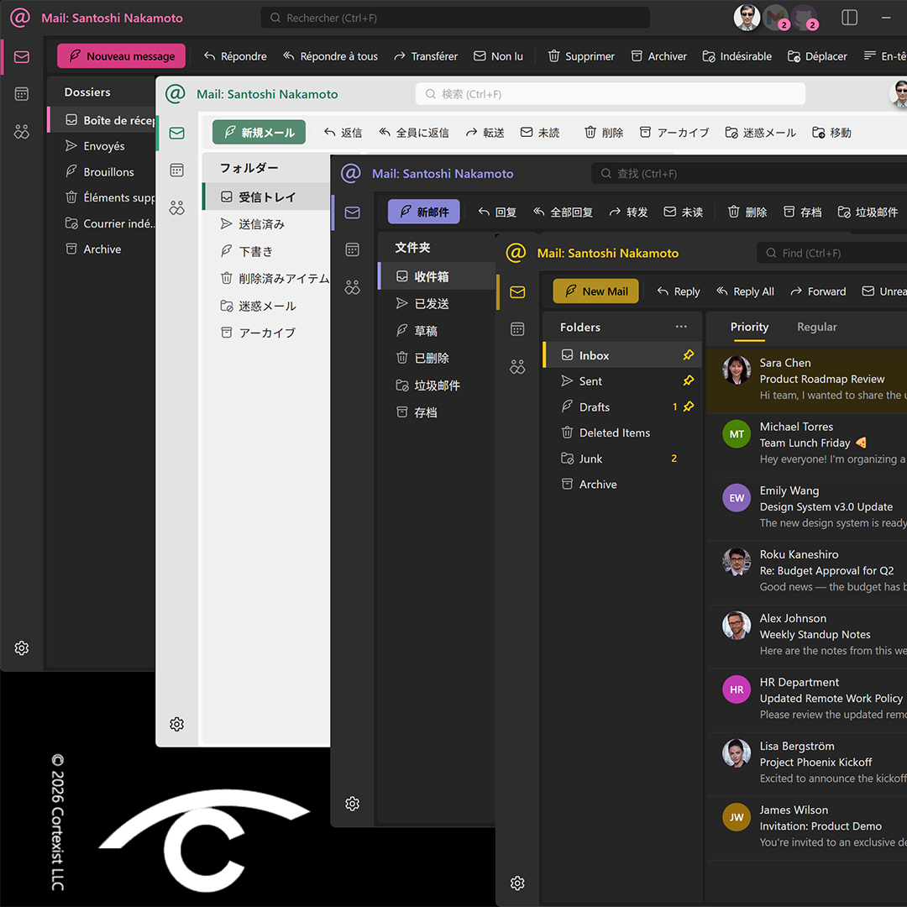

# Simple Mail
by Cortexist

A privacy-focused desktop mail, calendar, and contacts client built with Tauri, Svelte 5, and Rust. All data stays on your machine — no third-party cloud, no telemetry. Ships with light, dark, and system color themes, full internationalization in nine languages, and runs natively on Windows, macOS, and Linux.

[](https://www.buymeacoffee.com/cortexist)



## Features

### Mail
- IMAP sync and SMTP sending with multiple accounts
- Focused Inbox (automatic importance bucketing)
- Rich HTML compose with attachments, recipient autocomplete, and draft saving
- Folder management (create, delete, empty, favorites)
- Message actions: star, pin, move, delete, mark read/unread
- Autodiscover for automatic server configuration
- Offline outbox queue with retry

### Calendar
- CalDAV sync with full CRUD
- Day / Week / Month views
- Recurring events (daily, weekly, monthly, yearly) with exception dates
- Event alerts via OS notifications
- Attendees with roles, iMIP meeting invitations over email
- All-day events, online meeting detection

### Contacts
- CardDAV sync with full CRUD
- Contact favorites, photos, distribution lists
- Mute contacts (hide without deleting)
- Quick "Meet" action to schedule a meeting with a contact

### General
- Multi-account support
- Embedded CalDAV/CardDAV server for local-network client access
- Secure credential storage via OS keyring + AES-256-GCM
- Light, dark, and system theme
- Custom titlebar, keyboard-driven navigation
- Command bar for quick actions

## Recent Enhancements

Highlights since late March 2026:

### Reliability & Performance
- **Crash-safe send.** Every outbound mail is queued with a stable `Message-ID` before SMTP submission. If the app is killed mid-send, the next sync reconciles against the IMAP Sent folder by `Message-ID` to decide whether to retry — no more silent duplicates.
- **Parallel account sync.** IMAP, CalDAV, CardDAV, and outbox flush run concurrently instead of sequentially when clicking Sync.
- **Faster initial sync** and large-folder rendering; per-folder sync wrapped in SQLite transactions; hot-path indexes added.
- **Non-blocking send.** Compose window closes immediately; the send runs in the background.
- **Global network activity indicator** — a thin progress bar under the command bar shows whenever any backend call is in flight.

### Mail
- **Replied status** persisted via the IMAP `\Answered` flag with push sync; reply timestamp shown in ReadingPane.
- **Priority / Regular** replaces Focused / Other.
- **Batch selection mode**, batch mark read/unread, multi-select actions.
- **Junk mail filter** with sender blocklist.
- **SPF / DKIM / DMARC** authentication results parsed, surfaced in ReadingPane with inline warning styling.
- **Extra headers** fetch & display.
- **Attachment context menu** for save / open.
- **Autodiscover** improvements for mail server configuration.
- **Gmail labels as chips.** When the server advertises `X-GM-EXT-1`, `X-GM-LABELS` is fetched alongside envelopes and surfaced as read-only chips under the subject line in the reading pane. Internal markers (`\Inbox`, `\Sent`, `\Important`, `\Starred`, `CATEGORY_*`) are filtered out — they duplicate state already expressed elsewhere.
- **Gmail categories drive Priority bucketing.** Messages labeled `CATEGORY_PERSONAL` (Gmail's "Primary") land in Priority; `CATEGORY_PROMOTIONS` / `SOCIAL` / `UPDATES` / `FORUMS` go to Regular. Uncategorized messages keep the built-in heuristic. A manual Priority/Regular override by the user is never clobbered by a sync.
- **Viewport-triggered preview prefetch.** Older envelope-only messages fetch their bodies in batches (anchor + 20 after / 10 before) as they scroll into view, so previews fill in without a huge upfront sync. Attachment-only messages with no text body are fetched once and recorded as such so they don't re-trigger on every session.
- **Operator-aware search.** The search box accepts `from:alice`, `to:bob`, `subject:invoice`, `label:Work` (quote names with spaces: `label:"My Project"`), `is:read|unread|starred|replied|pinned|priority|regular`, and `has:attachment`. Bare words match subject, sender name/email, and full message body for downloaded messages. Clauses AND-combine. Clicking a label chip in the reading pane populates the search with `label:<name>`. An info icon next to the search box appears when the current account's body coverage is partial, explaining why some messages may be missed.
- **Offline download (opt-in per account).** A low-priority background worker backfills every message body for an account until it's fully searchable, with a cancellation token that stops cleanly on toggle-off and never deletes already-downloaded content. Gated behind an app-wide storage quota (configured in Settings → General → Storage) so disk use is bounded. Per-account toggles live on each account's page.
- **Muted senders.** Adding an address to the ignore list hides messages from that sender across the inbox and Contacts view. Toggle from the Contacts mute action; the list is app-wide.

### Calendar
- Keyboard-driven event editing and navigation.
- Calendar search navigation; active-day and month-today visibility improvements.
- Online meeting detection and iMIP invitation layout polish.
- **Default-calendar rename heuristic is now ambiguity-safe.** Providers often name the user's primary calendar after the account holder (e.g. "Nakamoto, Takeshi"); we rename it to "Calendar" for a cleaner sidebar. When the server advertises `schedule-default-calendar-URL` (RFC 6638), that one calendar is renamed authoritatively. Without it, we fall back to a name heuristic — but only rename when **exactly one** calendar is a candidate. Two or more ambiguous candidates are left with their server-provided names instead of all collapsing to "Calendar" and producing duplicate sidebar entries.

### Contacts
- **Multiple emails, phones, and addresses** per contact with labels, subtypes, and default selection.
- **Pinned Favorites section** at the top of the contact list (collapsible, order-preserving, no alphabet separators).
- Default field text cleaned up; font size tuned.

### Folders
- **Pin / Unpin folders** (replacing "Favorites") — pinned folders float to the top of a single unified Folders pane with a pin indicator.
- Folder actions menu always visible in the Folders header.

### Settings
- Settings content header now hosts icon-button **Save**, **Delete**, **Start/Stop Server** actions with shortcuts (Ctrl+S, Ctrl+D / Del, Alt+S, Alt+Shift+S).
- **Account ordering** via up/down buttons.
- **Local Sync server** user adds are staged until Save, for consistency with other editors.
- Hover avatar to add or remove a photo; extra buttons removed.

### Internationalization
- Full UI i18n across Mail, Calendar, Contacts, Compose, DatePicker, TimePicker, and Settings in **English, Spanish, French, German, Italian, Japanese, Korean, Simplified Chinese, and Traditional Chinese**.

### Keyboard & Navigation
- Consistent keyboard navigation across Calendar, MessageList, Contacts modal, and Settings.
- Global shortcuts: Ctrl+F5 (sync), Alt+S (settings), Esc (clear search), and more.
- **Alt+1 … Alt+9** to switch between accounts (no on-screen affordance for this today — documenting it here until a visual hint is added).

## Tech Stack

| Layer | Technology |
|-------|-----------|
| Desktop shell | [Tauri 2](https://tauri.app) |
| Frontend | [Svelte 5](https://svelte.dev) + [SvelteKit](https://kit.svelte.dev) + TypeScript |
| Backend | Rust 2021 + [Tokio](https://tokio.rs) async runtime |
| Database | SQLite (bundled via rusqlite) |
| Protocols | IMAP, SMTP, CalDAV (RFC 4791), CardDAV (RFC 6352), Autodiscover |

## Prerequisites

- [Node.js](https://nodejs.org) >= 18
- [Rust](https://rustup.rs) >= 1.77
- Platform build tools for [Tauri](https://v2.tauri.app/start/prerequisites/)

## Getting Started

```bash
# Install frontend dependencies
npm install

# Run in development mode
npm run tauri dev

# Build for production
npm run tauri build
```

The production binary and installer are output to `src-tauri/target/release/bundle/`.

## Provider Notes

### Gmail

Gmail no longer accepts your regular Google password over IMAP/SMTP. Use an **App Password**:

1. Go to https://myaccount.google.com/security and enable **2-Step Verification**. This is a required separate step — Google may already send SMS codes to your phone on risky sign-ins, but that is *not* the same as having 2-Step Verification turned on, and the App Passwords page stays hidden until you explicitly enable it.
2. Once 2-Step Verification is on, visit https://myaccount.google.com/apppasswords and generate a 16-character app password for Simple Mail.
3. In Simple Mail, add a Gmail account with:
   - IMAP: `imap.gmail.com` port `993`, SSL/TLS
   - SMTP: `smtp.gmail.com` port `465` (SSL) or `587` (STARTTLS)
   - Username: your full Gmail address
   - Password: the 16-character app password (not your Google password)

Gmail's `[Gmail]/All Mail` is intentionally not synced — on IMAP it contains every message in the account, including everything already visible in Inbox/Sent/Trash, so syncing it would duplicate the entire mailbox. This matches Thunderbird's default behavior. Messages you archived in Gmail web (removed from Inbox but kept only in All Mail) remain on the server and are reachable via the browser.

**Labels.** Simple Mail treats Gmail labels as display-only chips on the message, not as folders in the sidebar. User labels show as clickable chips under the subject line in the reading pane; clicking a chip runs a `label:<name>` search. Gmail's own internal markers (`\Inbox`, `\Starred`, `\Important`, `CATEGORY_*`) are hidden since they already map to other UI state. Custom user labels are currently read-only — adding or removing labels from within Simple Mail is not yet supported.

**Primary / Promotions / Social / Updates / Forums** are mapped to Simple Mail's Priority / Regular split: Primary → Priority, the other four → Regular. Uncategorized messages fall through to the built-in heuristic. If you manually change Priority/Regular on a message, your choice persists through syncs.

## Search

The search box in the command bar supports a small set of operators, AND-combined. Unknown tokens and bare words fall back to a free-text substring match, so simple searches still work.

| Operator | Example | Matches |
|----------|---------|---------|
| `from:` | `from:alice` | Sender name or email contains `alice` |
| `to:` | `to:team@` | Any recipient (To or Cc) contains the value |
| `subject:` | `subject:invoice` | Subject contains `invoice` |
| `label:` | `label:Receipts` / `label:"My Project"` | Message has the given label (exact, case-insensitive) |
| `is:` | `is:unread`, `is:starred`, `is:replied`, `is:pinned`, `is:priority`, `is:regular`, `is:read` | State flag check |
| `has:` | `has:attachment` | Message has at least one attachment |

Values with whitespace must be double-quoted. Example:

```
is:unread has:attachment from:amazon label:"Order Receipts"
```

### Search coverage

Free-text matches run against the **subject**, **sender name**, **sender email**, and the **full message body** — but the body is only checked for messages whose content has been downloaded. Envelope-only messages (older mail the client hasn't opened or prefetched) remain searchable on subject and sender only until their body arrives.

Bodies are populated by three paths:

- **On-demand** — opening a message in the reading pane fetches its body.
- **Viewport prefetch** — as older envelope-only rows scroll into view, the client fetches their bodies in batches (anchor + 20 older / 10 newer) and their previews fill in.
- **Offline download** — the background worker described above backfills every body on enabled accounts until the mailbox is fully indexed.

For each downloaded body, the client builds a lowercased, HTML-stripped `searchText` (no DOM parse — regex-based for bulk indexing at account load) and caches it on the email. Free-text filtering then runs as plain `.includes()` across that cached string, so filtering tens of thousands of messages per keystroke stays cheap. Preview text is no longer matched separately — it's a strict prefix of `searchText` and would only produce redundant hits.

The `i` icon next to the search box appears whenever the active account's coverage is partial:

- Offline download is off → search covers subject/sender only.
- Offline download is on but still running → `X of Y messages indexed` with the rest unlockable as they download.

## Project Structure

```
src/                      # Svelte 5 frontend
  routes/+page.svelte     # Main app shell
  lib/components/         # UI components (CalendarView, ComposePane, ContactsView, ...)
  lib/data/               # Data service and mock data
  lib/types.ts            # Shared TypeScript types
src-tauri/                # Rust backend
  src/lib.rs              # Tauri commands and app state
  src/imap_client.rs      # IMAP protocol client
  src/smtp_client.rs      # SMTP protocol client
  src/caldav_client.rs    # CalDAV client
  src/carddav_client.rs   # CardDAV client
  src/dav_server.rs       # Embedded DAV server
  src/autodiscover.rs     # Mail server autodiscovery
  src/db.rs               # SQLite schema and migrations
  src/crypto.rs           # AES-256-GCM encryption utilities
```

## License

[MIT](LICENSE) &copy; 2026 Cortexist, LLC
